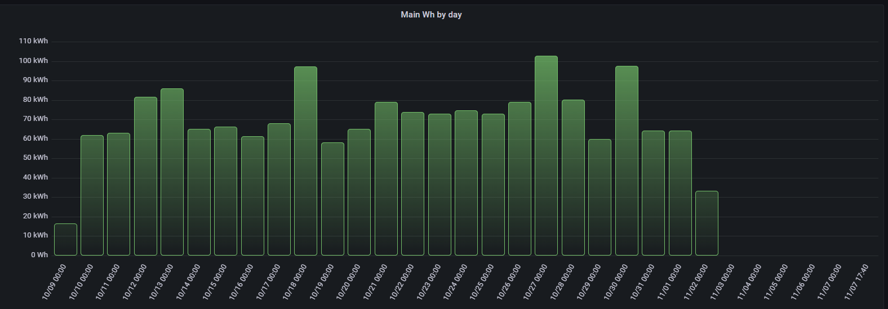

# flux-library
  
I am working on some energy graphs using data from iotawatt pushed into Influxdb2, and displayed with Grafana.   This is a short library of flux snipits etc that I found helpful.

## Easy wins
### Dealing with Timezomes
First getting the data to display by your timezone is easy with this little snipit:

```
// Setup your timezone info so that the day resets for you correctly.
import "timezone" 
option location = timezone.location(name: "America/Los_Angeles")
```

### Some graph examples
First we have total Wh by day.   This grabs the measurements and then sums them by 1 day based on your timezone.


 ```
 // Setup your timezone info so that the day resets for you correctly.
import "timezone" 
option location = timezone.location(name: "America/Los_Angeles")

// Query to grab Watt hours from db
from(bucket: "iotawatt_new")
  |> range(start: v.timeRangeStart, stop: v.timeRangeStop)
  |> filter(fn: (r) => r["_measurement"] == "Main_wh")
  |> filter(fn: (r) => r["_field"] == "value")
//  |> map(fn: (r) => ({r with _value: r._value / 1000.0})) //To convert to kWh if needed, but latest grafana changes scale for you automatically
// sum the values by day.  
  |> aggregateWindow(every: 1d, fn: sum)
// give the counter a friendly name.   
  |> map(fn: (r) => ({_value: r._value, _time: r._time, _field: "Main Wh"}))
  |> yield(name: "mean")
```
